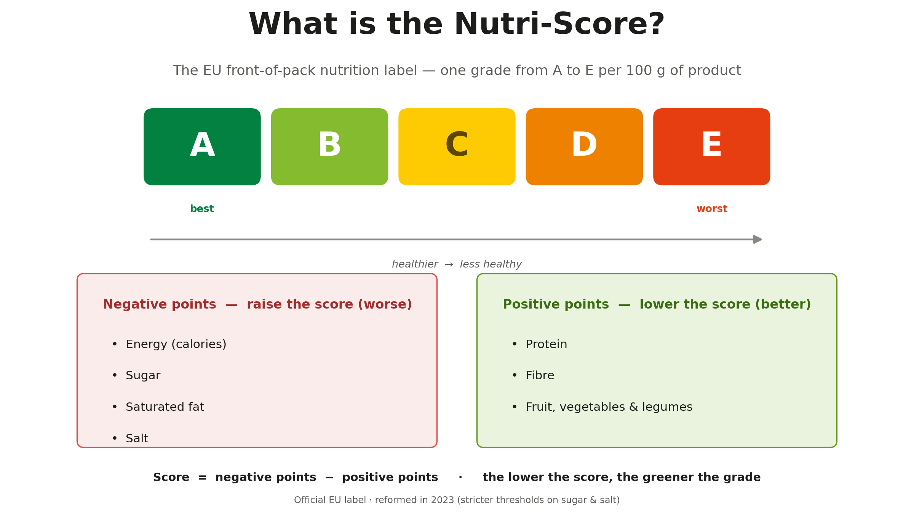
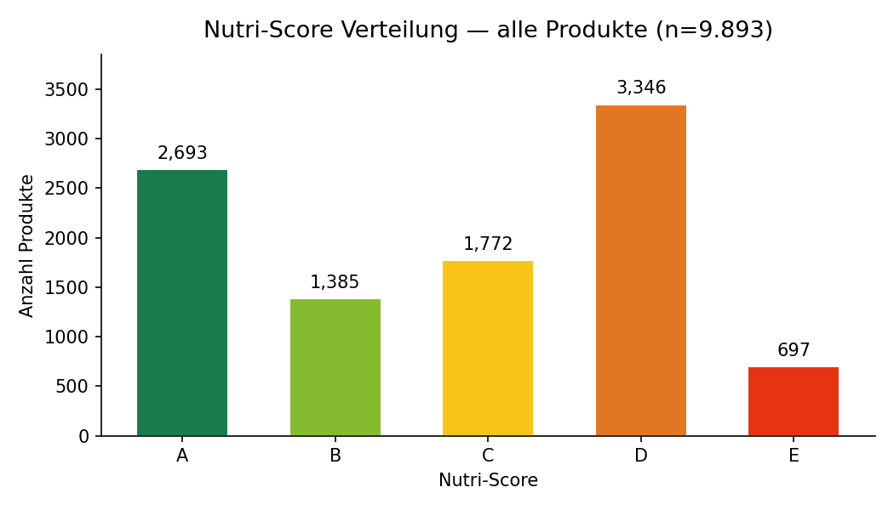
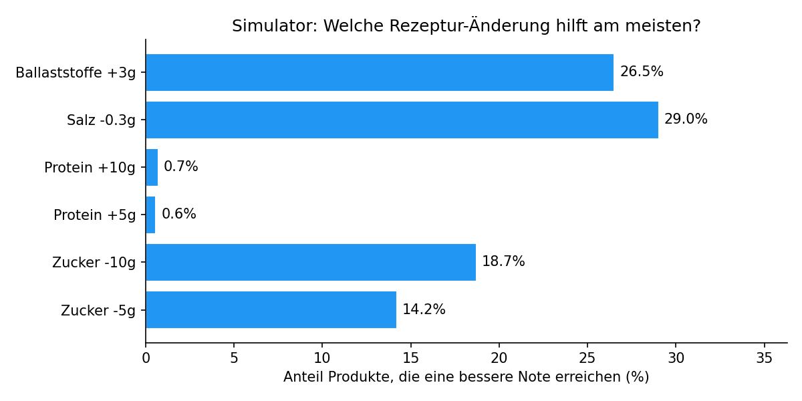

# 🥗 NutriHack — What single recipe change lifts a Nutri-Score grade at the lowest cost?

📊 A certified Nutri-Score 2024 engine + what-if simulator for the European protein-products market
🏆 Final capstone project for the Data Analytics bootcamp at neue fische / SPICED Academy

## 🧠 Project Summary

The **Nutri-Score** is the EU front-of-pack nutrition label: one grade from **A (best)** to **E (worst)** per 100 g. Retailers increasingly demand good grades — and the **2023 reform** made thresholds stricter, so real products silently lost grades without changing a single ingredient.

**NutriHack answers one question for manufacturers:**

> *What single change to the recipe will raise my product's Nutri-Score rating at the lowest cost?*

To answer it, I built:

- a **certified scoring engine** — the Nutri-Score 2024 algorithm implemented in Python, backed by a validation suite (unit tests, threshold-fidelity checks, input contracts, two adversarial code reviews with every finding closed)
- a **cleaning pipeline with a provenance layer** — every imputed value is flagged per row, so estimated data can never hide behind a grade
- a **what-if simulator** — 8 recipe scenarios pre-computed by the engine for every product
- an **interactive Tableau story** — 6 story points, presented live at the defense



## 📌 Main Insights

| # | Finding |
|---|---|
| 1 | **The market clusters at grade D.** 41% of ~9,775 graded protein products score D or E — in an industry that sells health. |
| 2 | **Cutting salt is the cheapest lever.** Salt −0.3 g/100 g lifts **2,837 products** a full grade; salt −0.6 g lifts **3,816 (≈39% of the market)**. |
| 3 | **Adding protein is the worst lever — in a protein market.** Protein +10 g helps just **69 products**. The reason is the *protein cap*: at ≥11 negative points, protein no longer counts toward the score. |
| 4 | **The finding survives the data-quality test.** 59% of products contain at least one estimated value — restricted to the 4,029 fully-measured products, the ranking holds: salt on top, protein at the bottom. |
| 5 | **The 2023 reform downgrades real products.** 9 products lost up to two grades from the rule change alone — same recipe, worse label. |





## 🎬 The Defense Story

The final deliverable is a packaged Tableau workbook — **[`visualizations/Nutrihack_Final.twbx`](visualizations/Nutrihack_Final.twbx)** — fully self-contained (data + extracts + images bundled). Download it and open it in Tableau Desktop / Tableau Public Desktop; the 6-point story walks from *"What is the Nutri-Score?"* to a **live simulation** where a real product (MyProtein Impact Vegan Protein, salt 3.0 g/100 g) flips **D → C** by cutting salt −0.6 g.

## 🏗️ Architecture

```
Open Food Facts API          Gustavo Gusto pizzas + curated demo targets
        │                                     │ (engine sanity test cases)
        ▼                                     ▼
  nutrihack_extract.py  ──►  nutrihack_clean.py  ──►  nutrihack_score.py
                              (plausibility caps,      (certified engine:
                               Atwater energy guard,    src/nutriscore,
                               median imputation,       Nutri-Score 2024)
                               PROVENANCE FLAGS)              │
                                                              ▼
                              nutrihack_tableau_export.py (+ 8 what-if scenarios)
                                                              │
                                                              ▼
                                     Tableau story (Nutrihack_Final.twbx)
```

**Honesty by design:** beverages (86 products) use a separate Nutri-Score ruleset and are deliberately flagged `REVIEW_REQUIRED` instead of being graded wrong. Fruit/veg/legume content is assumed 0 for protein products — a structural, conservative assumption that can only worsen a score, tracked with its own flag.

## 📂 Project Files

- `src/nutriscore/` — the certified Nutri-Score 2024 engine (pure Python, no dependencies)
- `scripts/` — pipeline stages: extract → clean → score → Tableau export (+ what-if simulation, test-case export)
- `tests/` — validation suite: engine unit tests, threshold fidelity, ladder semantics, cleaning-pipeline tests
- `notebooks/` — exploration and analysis notebooks
- `visualizations/` — the final packaged workbook, the hand-built Tableau workbook (`v3.twb`), and analysis PNGs
- `docs/` — analysis write-ups (e.g. the FVL-exception question)

## 🧰 Tools & Technologies

- **Python** (pandas) — extraction, cleaning, scoring, simulation
- **Custom scoring engine** — Nutri-Score 2024 ladders implemented and tested from the official specification
- **Tableau** — dashboards, parameter-driven live simulator, story-based presentation
- **Open Food Facts API** — market data (~9,861 protein products after cleaning)
- **Git/GitHub** — versioned pipeline and deliverables

## ⚙️ How to Run

```bash
pip install -r requirements.txt

# reproduce the pipeline
python scripts/nutrihack_extract.py        # pull raw data from Open Food Facts
python scripts/nutrihack_clean.py          # clean + impute + provenance flags
python scripts/nutrihack_score.py          # score with the certified engine
python scripts/nutrihack_tableau_export.py # add what-if scenarios, export for Tableau

# run the validation suite
python tests/test_clean_pipeline.py
```

## ⚠️ Limitations

- **Label data only** — no prices or sales figures; "lowest cost" is proxied by the smallest recipe change (salt reduction is also technologically cheap).
- **Open Food Facts is crowd-sourced** — 59% of products contain at least one estimated value; the provenance layer makes this visible, and every headline finding was re-verified on fully-measured products only.
- **Scope: protein products** — other categories may rank the levers differently.

## 👤 Author

**Viktor Kovalev**
Data Analyst · [GitHub](https://github.com/viktorkovalev207)
